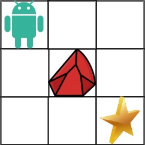

<!-- vim-markdown-toc GFM -->

* [简单难度](#简单难度)
	* [231. 2 的幂](#231-2-的幂)
	* [191. 位 1 的个数](#191-位-1-的个数)
	* [69. x 的平方根](#69-x-的平方根)
	* [111. 二叉树的最小深度](#111-二叉树的最小深度)
	* [104. 二叉树的最大深度](#104-二叉树的最大深度)
	* [121. 买卖股票的最佳时机](#121-买卖股票的最佳时机)
	* [122. 买卖股票的最佳时机 II](#122-买卖股票的最佳时机-ii)
	* [169. 多数元素](#169-多数元素)
	* [242. 有效的字母异位词](#242-有效的字母异位词)
	* [剑指 Offer 25. 合并两个排序的链表](#剑指-offer-25-合并两个排序的链表)
	* [88. 合并两个有序数组](#88-合并两个有序数组)
	* [剑指 Offer 09. 用两个栈实现队列](#剑指-offer-09-用两个栈实现队列)
	* [20. 有效的括号](#20-有效的括号)
	* [剑指 Offer 57. 和为 s 的两个数字](#剑指-offer-57-和为-s-的两个数字)
	* [206. 反转链表](#206-反转链表)
	* [141. 环形链表](#141-环形链表)
* [中等难度](#中等难度)
	* [19. 删除链表的倒数第 N 个节点](#19-删除链表的倒数第-n-个节点)
	* [200. 岛屿数量](#200-岛屿数量)
	* [22. 括号生成](#22-括号生成)
	* [62. 不同路径](#62-不同路径)
	* [63. 不同路径 II](#63-不同路径-ii)
	* [338. 比特位计数](#338-比特位计数)
	* [208. 实现 Trie （前缀树）](#208-实现-trie-前缀树)
	* [264. 丑数 II](#264-丑数-ii)
	* [36. 有效的数独](#36-有效的数独)
	* [328. 奇偶链表](#328-奇偶链表)
	* [102. 二叉树的层序遍历](#102-二叉树的层序遍历)
	* [50. Pow(x, n)](#50-powx-n)
	* [236. 二叉树的最近公共祖先](#236-二叉树的最近公共祖先)
	* [235. 二叉搜索树的最近公共祖先](#235-二叉搜索树的最近公共祖先)
	* [98. 验证二叉搜索树](#98-验证二叉搜索树)
	* [18. 四数之和](#18-四数之和)
	* [15. 三数之和](#15-三数之和)
	* [24. 两两交换链表中的节点](#24-两两交换链表中的节点)
	* [剑指 Offer 35. 复杂链表的复制](#剑指-offer-35-复杂链表的复制)
* [困难难度](#困难难度)
	* [37. 解数独](#37-解数独)
	* [剑指 Offer 37. 序列化二叉树](#剑指-offer-37-序列化二叉树)
	* [51. N 皇后](#51-n-皇后)
	* [剑指 Offer 59 - I. 滑动窗口的最大值](#剑指-offer-59---i-滑动窗口的最大值)

<!-- vim-markdown-toc -->

## 简单难度

### 231. 2 的幂

- 题目描述

```
给定一个整数，编写一个函数来判断它是否是 2 的幂次方。

示例 1:
输入：1
输出：true
解释：20 = 1

示例 2:
输入：16
输出：true
解释：24 = 16

示例 3:
输入：218
输出：false
```

- 方法一：log

```javascript
var isPowerOfTwo = function (n) {
  if (n <= 0) return false;
  return (Math.log10(n) / Math.log10(2)) % 1 === 0;
};
```

- 方法二：位运算

```javascript
var isPowerOfTwo = function (n) {
  if (n <= 0) return false;
  return (n & (n - 1)) === 0;
};
```

- 方法三：mod

```javascript
var isPowerOfTwo = function (n) {
  if (n < 1) return false;
  while (n % 2 === 0) {
    n /= 2;
  }
  return n === 1;
};
```

### 191. 位 1 的个数

- 题目描述

```
编写一个函数，输入是一个无符号整数（以二进制串的形式），返回其二进制表达式中数字位数为 '1' 的个数（也被称为汉明重量）。

提示：

请注意，在某些语言（如 Java）中，没有无符号整数类型。在这种情况下，输入和输出都将被指定为有符号整数类型，并且不应影响您的实现，因为无论整数是有符号的还是无符号的，其内部的二进制表示形式都是相同的。
在 Java 中，编译器使用二进制补码记法来表示有符号整数。因此，在上面的 示例 3 中，输入表示有符号整数 -3。

进阶：

如果多次调用这个函数，你将如何优化你的算法？

示例 1：
输入：00000000000000000000000000001011
输出：3
解释：输入的二进制串 00000000000000000000000000001011 中，共有三位为 '1'。

示例 2：
输入：00000000000000000000000010000000
输出：1
解释：输入的二进制串 00000000000000000000000010000000 中，共有一位为 '1'。

示例 3：
输入：11111111111111111111111111111101
输出：31
解释：输入的二进制串 11111111111111111111111111111101 中，共有 31 位为 '1'。

提示：
输入必须是长度为 32 的 二进制串 。
```

- 方法一：位运算 I

```javascript
var hammingWeight = function (n) {
  let res = 0;
  while (n) {
    if (n & 1) res++;
    n = (n / 2) | 0;
  }
  return res;
};
```

- 方法二：位运算 II

```javascript
var hammingWeight = function (n) {
  let res = 0;
  while (n) {
    res++;
    n = n & (n - 1);
  }
  return res;
};
```

- 方法三：正则

```javascript
var hammingWeight = function (n) {
  return n.toString(2).replace(/0/g, "").length;
};
```

### 69. x 的平方根

- 题目描述

```
实现 int sqrt(int x) 函数。
计算并返回 x 的平方根，其中 x 是非负整数。
由于返回类型是整数，结果只保留整数的部分，小数部分将被舍去。

示例 1:

输入：4
输出：2
示例 2:

输入：8
输出：2
说明：8 的平方根是 2.82842...,
     由于返回类型是整数，小数部分将被舍去。
```

- 方法一：二分法

```javascript
var mySqrt = function (x) {
  if (x === 0 || x === 1) return x;
  let l = 1;
  let r = x;
  let res;
  while (l <= r) {
    let m = (l + r) >> 1;
    if (m === x / m) return m;
    else if (m > x / m) r = m - 1;
    else {
      l = m + 1;
      res = m;
    }
  }
  return res;
};
```

- 方法二：牛顿迭代法

```javascript
var mySqrt = function (x) {
  if (x === 0 || x === 1) return x;
  let r = x;
  while (r * r > x) {
    r = ((r + x / r) / 2) | 0;
  }
  return r;
};
```

### 111. 二叉树的最小深度

- 题目描述

```
给定一个二叉树，找出其最小深度。
最小深度是从根节点到最近叶子节点的最短路径上的节点数量。
说明：叶子节点是指没有子节点的节点。

示例 1：

输入：root = [3,9,20,null,null,15,7]
输出：2
示例 2：

输入：root = [2,null,3,null,4,null,5,null,6]
输出：5
```

- 方法一：BFS

```javascript
/**
 * @param {TreeNode} root
 * @return {number}
 */
var minDepth = function (root) {
  if (root === null) return 0;
  let level = 0;
  let list = [root];
  while (list.length) {
    let len = list.length;
    level++;
    for (let i = 0; i < len; i++) {
      let node = list.shift();
      if (node) {
        if (!node.left && !node.right) return level;
        node.left && list.push(node.left);
        node.right && list.push(node.right);
      }
    }
  }
  return level;
};
```

- 方法二：DFS

```javascript
/**
 * @param {TreeNode} root
 * @return {number}
 */
var minDepth = function (root) {
  if (root === null) return 0;
  if (!root.left) return 1 + minDepth(root.right);
  if (!root.right) return 1 + minDepth(root.left);
  return 1 + Math.min(minDepth(root.left), minDepth(root.right));
};
```

### 104. 二叉树的最大深度

- 题目描述

```
给定一个二叉树，找出其最大深度。

二叉树的深度为根节点到最远叶子节点的最长路径上的节点数。

说明： 叶子节点是指没有子节点的节点。

示例：
给定二叉树 [3,9,20,null,null,15,7]，

    3
   / \
  9  20
    /  \
   15   7
返回它的最大深度 3 。
```

- 方法一：BFS

```javascript
/**
 * @param {TreeNode} root
 * @return {number}
 */
var maxDepth = function (root) {
  if (root === null) return 0;
  let level = 0;
  let list = [root];
  while (list.length) {
    let len = list.length;
    for (let i = 0; i < len; i++) {
      let node = list.shift();
      if (node) {
        node.left && list.push(node.left);
        node.right && list.push(node.right);
      }
    }
    level++;
  }
  return level;
};
```

- 方法二：DFS

```javascript
/**
 * @param {TreeNode} root
 * @return {number}
 */
var maxDepth = function (root) {
  if (root === null) return 0;
  return 1 + Math.max(maxDepth(root.left), maxDepth(root.right));
};
```

### 121. 买卖股票的最佳时机

- 题目描述

```
给定一个数组，它的第 i 个元素是一支给定股票第 i 天的价格。

如果你最多只允许完成一笔交易（即买入和卖出一支股票一次），设计一个算法来计算你所能获取的最大利润。

注意：你不能在买入股票前卖出股票。
```

- 方法：贪心算法

```javascript
/**
 * @param {number[]} prices
 * @return {number}
 */
var maxProfit = function (prices) {
  let [benefit, min] = [0, prices[0]];
  for (let i = 1, len = prices.length; i < len; i++) {
    min = Math.min(min, prices[i]);
    benefit = Math.max(benefit, prices[i] - min);
  }
  return benefit;
};
```

### 122. 买卖股票的最佳时机 II

- 题目描述

```
给定一个数组，它的第 i 个元素是一支给定股票第 i 天的价格。
设计一个算法来计算你所能获取的最大利润。你可以尽可能地完成更多的交易（多次买卖一支股票）。
注意：你不能同时参与多笔交易（你必须在再次购买前出售掉之前的股票）。

示例 1:

输入：[7,1,5,3,6,4]
输出：7
解释：在第 2 天（股票价格 = 1）的时候买入，在第 3 天（股票价格 = 5）的时候卖出，这笔交易所能获得利润 = 5-1 = 4 。
     随后，在第 4 天（股票价格 = 3）的时候买入，在第 5 天（股票价格 = 6）的时候卖出，这笔交易所能获得利润 = 6-3 = 3 。

示例 2:

输入：[1,2,3,4,5]
输出：4
解释：在第 1 天（股票价格 = 1）的时候买入，在第 5 天 （股票价格 = 5）的时候卖出，这笔交易所能获得利润 = 5-1 = 4 。
     注意你不能在第 1 天和第 2 天接连购买股票，之后再将它们卖出。
     因为这样属于同时参与了多笔交易，你必须在再次购买前出售掉之前的股票。
示例 3:

输入：[7,6,4,3,1]
输出：0
解释：在这种情况下，没有交易完成，所以最大利润为 0。
```

- 方法：贪心算法

```javascript
/**
 * @param {number[]} prices
 * @return {number}
 */
var maxProfit = function (prices) {
  let benefit = 0;
  for (let i = 1, len = prices.length; i < len; i++) {
    benefit += Math.max(prices[i] - prices[i - 1], 0);
  }
  return benefit;
};
```

### 169. 多数元素

- 题目描述

```
给定一个大小为 n 的数组，找到其中的多数元素。多数元素是指在数组中出现次数大于 ⌊ n/2 ⌋ 的元素。

你可以假设数组是非空的，并且给定的数组总是存在多数元素。

示例 1:

输入：[3,2,3]
输出：3
示例 2:

输入：[2,2,1,1,1,2,2]
输出：2
```

- 方法一：排序

```javascript
/**
 * @param {number[]} nums
 * @return {number}
 */
var majorityElement = function (nums) {
  nums.sort((a, b) => a - b);
  let mid = ((nums.length - 1) / 2) | 0;
  return nums[mid];
};
```

- 方法二：Hashmap

```javascript
/**
 * @param {number[]} nums
 * @return {number}
 */
var majorityElement = function (nums) {
  let map = new Map();
  let len = nums.length;
  let target = len / 2;

  for (let i = 0; i < len; i++) {
    if (!map.has(nums[i])) map.set(nums[i], 0);
    let count = map.get(nums[i]) + 1;
    map.set(nums[i], count);
    if (count > target) return nums[i];
  }
};
```

- 方法三：摩尔投票法

```javascript
var majorityElement = function (nums) {
  // 摩尔投票法：
  let result = [1, nums[0]];
  for (let i = 1, len = nums.length; i < len; i++) {
    if (nums[i] === result[1]) result[0] += 1;
    else {
      result[0] -= 1;
      if (!result[0]) result[1] = nums[i + 1];
    }
  }
  return result[1];
};
```

### 242. 有效的字母异位词

- 题目描述

```
给定两个字符串 s 和 t ，编写一个函数来判断 t 是否是 s 的字母异位词。

示例 1:

输入：s = "anagram", t = "nagaram"
输出：true
示例 2:

输入：s = "rat", t = "car"
输出：false
```

- 方法一：排序

```javascript
/**
 * @param {string} s
 * @param {string} t
 * @return {boolean}
 */
var isAnagram = function (s, t) {
  return Array.from(s).sort().join("") === Array.from(t).sort().join("");
};
```

- 方法二：Hashmap

```javascript
var isAnagram = function (s, t) {
  let map = new Map();

  for (let i = 0, sLen = s.length; i < sLen; i++) {
    if (!map.has(s[i])) map.set(s[i], 0);
    map.set(s[i], map.get(s[i]) + 1);
  }

  for (let j = 0, tLen = t.length; j < tLen; j++) {
    if (!map.has(t[j])) return false;
    map.set(t[j], map.get(t[j]) - 1);
    if (map.get(t[j]) === 0) map.delete(t[j]);
  }

  return !map.size;
};
```

- 方法三：ASCII 和比较

```javascript
/**
 * @param {string} s
 * @param {string} t
 * @return {boolean}
 */
var isAnagram = function (s, t) {
  let sum = 0;
  for (let i = 0, sLen = s.length; i < sLen; i++) {
    sum += s[i].codePointAt() ** 0.5;
  }
  for (let j = 0, tLen = t.length; j < tLen; j++) {
    sum -= t[j].codePointAt() ** 0.5;
  }
  // 当两个串的 ASCII 差小于 1e-5 时认为它们相等
  return Math.abs(sum) < 1e-5;
};
```

### 剑指 Offer 25. 合并两个排序的链表

- 题目描述

```
输入两个递增排序的链表，合并这两个链表并使新链表中的节点仍然是递增排序的。

示例 1：

输入：1->2->4, 1->3->4
输出：1->1->2->3->4->4
```

- 方法：迭代

```javascript
var mergeTwoLists = function (l1, l2) {
  let root = new ListNode(-1);
  let cur = root;
  while (l1 && l2) {
    if (l1.val < l2.val) {
      cur.next = l1;
      l1 = l1.next;
    } else {
      cur.next = l2;
      l2 = l2.next;
    }
    cur = cur.next;
  }
  cur.next = l1 ? l1 : l2;
  return root.next;
};
```

### 88. 合并两个有序数组

- 题目描述

```
给你两个有序整数数组 nums1 和 nums2，请你将 nums2 合并到 nums1 中，使 nums1 成为一个有序数组。
 
说明：

初始化 nums1 和 nums2 的元素数量分别为 m 和 n 。
你可以假设 nums1 有足够的空间（空间大小大于或等于 m + n）来保存 nums2 中的元素。
 

示例：

输入：
nums1 = [1,2,3,0,0,0], m = 3
nums2 = [2,5,6],       n = 3

输出：[1,2,2,3,5,6]
```

- 方法：从后往前比较

```javascript
/**
 * @param {number[]} nums1
 * @param {number} m
 * @param {number[]} nums2
 * @param {number} n
 * @return {void} Do not return anything, modify nums1 in-place instead.
 */
var merge = function (nums1, m, nums2, n) {
  let p = m-- + n-- - 1;

  while (m >= 0 && n >= 0) {
    nums1[p--] = nums1[m] < nums2[n] ? nums2[n--] : nums1[m--];
  }

  while (n >= 0) {
    nums1[p--] = nums2[m--];
  }
};
```

### 剑指 Offer 09. 用两个栈实现队列

- 题目描述

```
用两个栈实现一个队列。队列的声明如下，请实现它的两个函数 appendTail 和 deleteHead ，分别完成在队列尾部插入整数和在队列头部删除整数的功能。
（若队列中没有元素，deleteHead 操作返回 -1 )

示例 1：

输入：
["CQueue","appendTail","deleteHead","deleteHead"]
[[],[3],[],[]]
输出：[null,null,3,-1]
示例 2：

输入：
["CQueue","deleteHead","appendTail","appendTail","deleteHead","deleteHead"]
[[],[],[5],[2],[],[]]
输出：[null,-1,null,null,5,2]
```

- 方法：双栈模拟队列

```javascript
var CQueue = function () {
  this.iptStack = []; // 输入栈
  this.optStack = []; // 输出栈
};

/**
 * @param {number} value
 * @return {void}
 */
CQueue.prototype.appendTail = function (value) {
  this.iptStack.push(value);
};

/**
 * @return {number}
 */
CQueue.prototype.deleteHead = function () {
  let iptStack = this.iptStack;
  let optStack = this.optStack;
  if (!iptStack.length && !optStack.length) {
    return -1;
  }
  if (!optStack.length) {
    while (iptStack.length) {
      optStack.push(iptStack.pop());
    }
  }
  return optStack.pop();
};
```

### 20. 有效的括号

- 题目描述

```javascript
给定一个只包括 '('，')'，'{'，'}'，'['，']' 的字符串，判断字符串是否有效。

有效字符串需满足：

左括号必须用相同类型的右括号闭合。
左括号必须以正确的顺序闭合。
注意空字符串可被认为是有效字符串。

示例 1:

输入："()"
输出：true
示例 2:

输入："()[]{}"
输出：true
示例 3:

输入："(]"
输出：false
示例 4:

输入："([)]"
输出：false
示例 5:

输入："{[]}"
输出：true
```

- 方法：堆栈

```javascript
var isValid = function (s) {
  let map = new Map([
    ["}", "{"],
    [")", "("],
    ["]", "["],
  ]);
  let stack = [];
  for (let i = 0, len = s.length; i < len; i++) {
    if (!map.has(s[i])) {
      stack.push(s[i]);
    } else {
      if (stack.pop() !== map.get(s[i])) {
        return false;
      }
    }
  }
  return !stack.length;
};
```

### 剑指 Offer 57. 和为 s 的两个数字

- 题目描述

```
输入一个递增排序的数组和一个数字 s，在数组中查找两个数，使得它们的和正好是 s。如果有多对数字的和等于 s，则输出任意一对即可。

示例 1：

输入：nums = [2,7,11,15], target = 9
输出：[2,7] 或者 [7,2]
示例 2：

输入：nums = [10,26,30,31,47,60], target = 40
输出：[10,30] 或者 [30,10]
```

- 方法一：Hashmap

```javascript
/**
 * @param {number[]} nums
 * @param {number} target
 * @return {number[]}
 */
var twoSum = function (nums, target) {
  let set = new Set();
  for (let i = 0, len = nums.length; i < len; i++) {
    let y = target - nums[i];
    if (set.has(y)) {
      return [nums[i], y];
    }
    set.add(nums[i]);
  }
};
```

- 方法二：双指针

```javascript
var twoSum = function (nums, target) {
  let l = 0;
  let r = nums.length - 1;

  while (l < r) {
    let sum = nums[l] + nums[r];
    if (sum < target) l++;
    else if (sum > target) r--;
    else return [nums[l], nums[r]];
  }
};
```

### 206. 反转链表

- 题目描述

```
反转一个单链表。

示例：

输入：1->2->3->4->5->NULL
输出：5->4->3->2->1->NULL
```

- 方法：迭代

```javascript
var reverseList = function (head) {
  let pre = null;
  let cur = head;
  let tmp;
  while (cur) {
    tmp = cur.next;
    cur.next = pre;
    pre = cur;
    cur = tmp;
  }
  return pre;
};
```

### 141. 环形链表

- 题目描述

```
给定一个链表，判断链表中是否有环。
如果链表中有某个节点，可以通过连续跟踪 next 指针再次到达，则链表中存在环。
为了表示给定链表中的环，我们使用整数 pos 来表示链表尾连接到链表中的位置（索引从 0 开始）。
如果 pos 是 -1，则在该链表中没有环。注意：pos 不作为参数进行传递，仅仅是为了标识链表的实际情况。
如果链表中存在环，则返回 true 。 否则，返回 false 。

进阶：
你能用 O(1)（即，常量）内存解决此问题吗？

示例 1：

输入：head = [3,2,0,-4], pos = 1
输出：true
解释：链表中有一个环，其尾部连接到第二个节点。

示例 2：

输入：head = [1,2], pos = 0
输出：true
解释：链表中有一个环，其尾部连接到第一个节点。

示例 3：

输入：head = [1], pos = -1
输出：false
解释：链表中没有环。
```

- 方法一：Hashmap

```javascript
var hasCycle = function (head) {
  let set = new Set();
  let p = head;

  while (p) {
    if (set.has(p)) {
      return true;
    }
    set.add(p);
    p = p.next;
  }
  return false;
};
```

- 方法二：快慢指针

```javascript
var hasCycle = function (head) {
  let slow = head;
  let fast = head;

  while (slow && fast && fast.next) {
    slow = slow.next;
    fast = fast.next.next;
    if (slow === fast) {
      return true;
    }
  }

  return false;
};
```

## 中等难度

### 19. 删除链表的倒数第 N 个节点

- 题目描述

```
给定一个链表，删除链表的倒数第 n 个节点，并且返回链表的头结点。

示例：
给定一个链表：1->2->3->4->5, 和 n = 2.
当删除了倒数第二个节点后，链表变为 1->2->3->5.

说明：
给定的 n 保证是有效的。

进阶：
你能尝试使用一趟扫描实现吗？
```

- 方法一：双指针

```javascript
var removeNthFromEnd = function (head, n) {
  let p = head;
  let res = new ListNode(-1);
  let q = res;
  q.next = head;
  for (let i = 0; i < n; i++) p = p.next;
  while (p) {
    q = q.next;
    p = p.next;
  }
  q.next = q.next.next;
  return res.next;
};
```

- 方法二：len - n

```javascript
var removeNthFromEnd = function (head, n) {
  let len = 0;
  let p = head;
  while (p) {
    len++;
    p = p.next;
  }
  let res = new ListNode(-1);
  let q = res;
  q.next = head;
  for (let i = 0; i < len - n; i++) q = q.next;
  q.next = q.next.next;
  return res.next;
};
```

### 200. 岛屿数量

- 题目描述

```
给你一个由 '1'（陆地）和 '0'（水）组成的的二维网格，请你计算网格中岛屿的数量。
岛屿总是被水包围，并且每座岛屿只能由水平方向和 / 或竖直方向上相邻的陆地连接形成。
此外，你可以假设该网格的四条边均被水包围。

示例 1：
输入：grid = [
  ["1","1","1","1","0"],
  ["1","1","0","1","0"],
  ["1","1","0","0","0"],
  ["0","0","0","0","0"]
]
输出：1

示例 2：
输入：grid = [
  ["1","1","0","0","0"],
  ["1","1","0","0","0"],
  ["0","0","1","0","0"],
  ["0","0","0","1","1"]
]
输出：3
 
提示：
m == grid.length
n == grid[i].length
1 <= m, n <= 300
grid[i][j] 的值为 '0' 或 '1'
```

- 方法一：DFS

```javascript
var numIslands = function (grid) {
  if (!grid || !grid.length) return 0;
  let m = grid.length;
  let n = grid[0].length;
  let visited = new Set();
  let dx = [-1, 1, 0, 0]; // 左右
  let dy = [0, 0, -1, 1]; // 上下
  let count = 0;

  for (let i = 0; i < m; i++) for (let j = 0; j < n; j++) count += dfs(i, j);

  function dfs(x, y) {
    if (!isValid(x, y)) return 0;
    visited.add(`${x} ${y}`);
    for (let i = 0; i < 4; i++) dfs(x + dx[i], y + dy[i]);
    return 1;
  }

  function isValid(x, y) {
    if (x < 0 || x >= m || y < 0 || y >= n) return false;
    if (grid[x][y] == "0" || visited.has(`${x} ${y}`)) return false;
    return true;
  }

  return count;
};
```

### 22. 括号生成

- 题目描述

```
数字 n 代表生成括号的对数，请你设计一个函数，用于能够生成所有可能的并且 有效的 括号组合。

示例：
输入：n = 3
输出：[
       "((()))",
       "(()())",
       "(())()",
       "()(())",
       "()()()"
     ]
```

- 方法

```javascript
var generateParenthesis = function (n) {
  let res = [];
  function helper(l, r, s) {
    if (l === n && r === n) {
      res.push(s);
      return;
    }
    if (l < n) helper(l + 1, r, s + "(");
    if (l > r && r < n) helper(l, r + 1, s + ")");
  }
  helper(0, 0, "");
  return res;
};
```

### 62. 不同路径

- 题目描述

```
一个机器人位于一个 m x n 网格的左上角 （起始点在下图中标记为“Start” ）。
机器人每次只能向下或者向右移动一步。机器人试图达到网格的右下角（在下图中标记为“Finish”）。
问总共有多少条不同的路径？
例如，上图是一个 7 x 3 的网格。有多少可能的路径？

示例  1:
输入：m = 3, n = 2
输出：3
解释：
从左上角开始，总共有 3 条路径可以到达右下角。

1. 向右 -> 向右 -> 向下
2. 向右 -> 向下 -> 向右
3. 向下 -> 向右 -> 向右

示例  2:
输入：m = 7, n = 3
输出：28
```


- 方法一：DP

```javascript
var uniquePaths = function (m, n) {
  // a[i][j] = a[i][j - 1] + a[i - 1][j]
  let dp = new Array(m);
  for (let i = 0; i < m; i++) {
    dp[i] = new Array(n);
    for (let j = 0; j < n; j++) {
      if (i === 0 && j === 0) dp[i][j] = 1;
      else if (i === 0) dp[i][j] = dp[i][j - 1];
      else if (j === 0) dp[i][j] = dp[i - 1][j];
      else dp[i][j] = dp[i][j - 1] + dp[i - 1][j];
    }
  }
  return dp[m - 1][n - 1];
};
```

- DP + 滚动数组

```javascript
var uniquePaths = function (m, n) {
  // a[i][j] = a[i][j - 1] + a[i - 1][j]
  let dp = new Array(n);
  dp.fill(0);
  dp[0] = 1;
  for (let i = 0; i < m; i++) {
    for (let j = 0; j < n; j++) {
      if (j >= 1) dp[j] += dp[j - 1];
    }
  }
  return dp[n - 1];
};
```

### 63. 不同路径 II

- 题目描述

```
一个机器人位于一个 m x n 网格的左上角 （起始点在下图中标记为“Start” ）。
机器人每次只能向下或者向右移动一步。机器人试图达到网格的右下角（在下图中标记为“Finish”）。
现在考虑网格中有障碍物。那么从左上角到右下角将会有多少条不同的路径？

示例 1：
输入：obstacleGrid = [[0,0,0],[0,1,0],[0,0,0]]
输出：2
解释：
3x3 网格的正中间有一个障碍物。
从左上角到右下角一共有 2 条不同的路径：
1. 向右 -> 向右 -> 向下 -> 向下
2. 向下 -> 向下 -> 向右 -> 向右

示例 2：
输入：obstacleGrid = [[0,1],[0,0]]
输出：1

m == obstacleGrid.length
n == obstacleGrid[i].length
1 <= m, n <= 100
obstacleGrid[i][j] 为 0 或 1
```





- 方法一：DP

```javascript
var uniquePathsWithObstacles = function (obstacleGrid) {
  let m = obstacleGrid.length;
  let n = obstacleGrid[0].length;
  let dp = new Array(m);
  for (let i = 0; i < m; i++) {
    dp[i] = new Array(n);
    for (let j = 0; j < n; j++) {
      if (obstacleGrid[i][j] === 1) dp[i][j] = 0;
      else if (i === 0 && j === 0) dp[i][j] = 1;
      else if (i === 0) dp[i][j] = dp[i][j - 1];
      else if (j === 0) dp[i][j] = dp[i - 1][j];
      else dp[i][j] = dp[i][j - 1] + dp[i - 1][j];
    }
  }
  return dp[m - 1][n - 1];
};
```

- 方法二 DP + 滚动数组

```javascript
var uniquePathsWithObstacles = function (obstacleGrid) {
  let m = obstacleGrid.length;
  let n = obstacleGrid[0].length;
  let dp = new Array(n);
  dp.fill(0);
  dp[0] = 1;
  for (let i = 0; i < m; i++) {
    for (let j = 0; j < n; j++) {
      if (obstacleGrid[i][j] === 1) dp[j] = 0;
      else if (j >= 1 && obstacleGrid[i][j - 1] === 0) dp[j] += dp[j - 1];
    }
  }
  return dp[n - 1];
};
```

### 338. 比特位计数

- 题目描述

```
给定一个非负整数 num。对于 0 ≤ i ≤ num 范围中的每个数字 i ，计算其二进制数中的 1 的数目并将它们作为数组返回。

示例 1:
输入：2
输出：[0,1,1]

示例 2:
输入：5
输出：[0,1,1,2,1,2]

进阶：
给出时间复杂度为 O(n*sizeof(integer)) 的解答非常容易。但你可以在线性时间 O(n) 内用一趟扫描做到吗？
要求算法的空间复杂度为 O(n)。
你能进一步完善解法吗？要求在 C++ 或任何其他语言中不使用任何内置函数（如 C++ 中的 __builtin_popcount）来执行此操作。
```

- 方法

```javascript
var countBits = function (num) {
  let res = new Array(num + 1);
  res.fill(0);
  for (let i = 1; i <= num; i++) {
    res[i] = res[i & (i - 1)] + 1;
  }
  return res;
};
```

### 208. 实现 Trie （前缀树）

- 题目描述

```
实现一个 Trie （前缀树），包含 insert, search, 和 startsWith 这三个操作。

示例：

Trie trie = new Trie();

trie.insert("apple");
trie.search("apple");   // 返回 true
trie.search("app");     // 返回 false
trie.startsWith("app"); // 返回 true
trie.insert("app");
trie.search("app");     // 返回 true
说明：

你可以假设所有的输入都是由小写字母 a-z 构成的。
保证所有输入均为非空字符串。
```

- 方法

```javascript
/**
 * Initialize your data structure here.
 */
var Trie = function () {
  this.preTree = {};
  this.end = "#";
};

/**
 * Inserts a word into the trie.
 * @param {string} word
 * @return {void}
 */
Trie.prototype.insert = function (word) {
  let preTree = this.preTree;
  for (let i = 0, len = word.length; i < len; i++) {
    let w = word[i];
    if (!preTree[w]) preTree[w] = {};
    preTree = preTree[w];
  }
  preTree[this.end] = this.end;
};

/**
 * Returns if the word is in the trie.
 * @param {string} word
 * @return {boolean}
 */
Trie.prototype.search = function (word) {
  let preTree = this.preTree;
  for (let i = 0, len = word.length; i < len; i++) {
    let w = word[i];
    if (!preTree[w]) return false;
    preTree = preTree[w];
  }
  return this.end in preTree;
};

/**
 * Returns if there is any word in the trie that starts with the given prefix.
 * @param {string} prefix
 * @return {boolean}
 */
Trie.prototype.startsWith = function (prefix) {
  let preTree = this.preTree;
  for (let i = 0, len = prefix.length; i < len; i++) {
    let w = prefix[i];
    if (!preTree[w]) return false;
    preTree = preTree[w];
  }
  return true;
};

/**
 * Your Trie object will be instantiated and called as such:
 * var obj = new Trie()
 * obj.insert(word)
 * var param_2 = obj.search(word)
 * var param_3 = obj.startsWith(prefix)
 */
```

### 264. 丑数 II

- 题目描述

```
编写一个程序，找出第 n 个丑数。

丑数就是质因数只包含 2, 3, 5 的正整数。

示例：

输入：n = 10
输出：12
解释：1, 2, 3, 4, 5, 6, 8, 9, 10, 12 是前 10 个丑数。
说明：  

1 是丑数。
n 不超过 1690。
```

- 方法：迭代

```javascript
var nthUglyNumber = function (n) {
  let r = new Array(n + 1);
  r[0] = 0;
  r[1] = 1;
  let p2 = 1;
  let p3 = 1;
  let p5 = 1;
  for (let i = 2; i <= n; i++) {
    r[i] = Math.min(r[p2] * 2, r[p3] * 3, r[p5] * 5);
    if (r[i] === r[p2] * 2) p2++;
    if (r[i] === r[p3] * 3) p3++;
    if (r[i] === r[p5] * 5) p5++;
  }
  return r[n];
};
```

### 36. 有效的数独

- 题目描述

```
判断一个 9x9 的数独是否有效。只需要根据以下规则，验证已经填入的数字是否有效即可。

数字 1-9 在每一行只能出现一次。
数字 1-9 在每一列只能出现一次。
数字 1-9 在每一个以粗实线分隔的 3x3 宫内只能出现一次。

上图是一个部分填充的有效的数独。

数独部分空格内已填入了数字，空白格用 '.' 表示。

示例 1:

输入：
[
  ["5","3",".",".","7",".",".",".","."],
  ["6",".",".","1","9","5",".",".","."],
  [".","9","8",".",".",".",".","6","."],
  ["8",".",".",".","6",".",".",".","3"],
  ["4",".",".","8",".","3",".",".","1"],
  ["7",".",".",".","2",".",".",".","6"],
  [".","6",".",".",".",".","2","8","."],
  [".",".",".","4","1","9",".",".","5"],
  [".",".",".",".","8",".",".","7","9"]
]
输出：true
示例 2:

输入：
[
  ["8","3",".",".","7",".",".",".","."],
  ["6",".",".","1","9","5",".",".","."],
  [".","9","8",".",".",".",".","6","."],
  ["8",".",".",".","6",".",".",".","3"],
  ["4",".",".","8",".","3",".",".","1"],
  ["7",".",".",".","2",".",".",".","6"],
  [".","6",".",".",".",".","2","8","."],
  [".",".",".","4","1","9",".",".","5"],
  [".",".",".",".","8",".",".","7","9"]
]
输出：false
解释：除了第一行的第一个数字从 5 改为 8 以外，空格内其他数字均与 示例 1 相同。
     但由于位于左上角的 3x3 宫内有两个 8 存在，因此这个数独是无效的。
说明：

一个有效的数独（部分已被填充）不一定是可解的。
只需要根据以上规则，验证已经填入的数字是否有效即可。
给定数独序列只包含数字 1-9 和字符 '.' 。
给定数独永远是 9x9 形式的。
```

- 方法一：DFS

```javascript
/**
 * @param {character[][]} board
 * @return {boolean}
 */
var isValidSudoku = function (board) {
  function check(board, row, col, c) {
    for (let i = 0; i < 9; i++) {
      if (i != col && board[row][i] == c) return false;
      if (i != row && board[i][col] == c) return false;
    }
    let br = (row / 3) | 0;
    let bc = (col / 3) | 0;
    for (let i = 3 * br; i < 3 * br + 3; i++) {
      for (let j = 3 * bc; j < 3 * bc + 3; j++) {
        if (!(i == row && j == col) && board[i][j] == c) return false;
      }
    }
    return true;
  }

  for (let i = 0; i < 9; i++) {
    for (let j = 0; j < 9; j++) {
      let c = board[i][j];
      if (c == ".") continue;
      if (!check(board, i, j, c)) return false;
    }
  }
  return true;
};
```

- 方法二：Map

```javascript
/**
 * @param {character[][]} board
 * @return {boolean}
 */
var isValidSudoku = function (board) {
  let row = createArray(9, 9);
  let col = createArray(9, 9);
  let block = createArray(9, 9);

  for (let i = 0; i < 9; i++) {
    for (let j = 0; j < 9; j++) {
      if (board[i][j] === ".") continue;
      let num = board[i][j] - 1;
      let b = ((i / 3) | 0) * 3 + ((j / 3) | 0);
      if (row[i][num] || col[j][num] || block[b][num]) return false;
      else {
        row[i][num] = 1;
        col[j][num] = 1;
        block[b][num] = 1;
      }
    }
  }

  return true;
};

function createArray(m, n) {
  let res = new Array(m);
  for (let i = 0; i < m; i++) {
    res[i] = new Array(n);
    for (let j = 0; j < n; j++) {
      res[i][j] = 0;
    }
  }
  return res;
}
```

### 328. 奇偶链表

- 题目描述

```
给定一个单链表，把所有的奇数节点和偶数节点分别排在一起。请注意，这里的奇数节点和偶数节点指的是节点编号的奇偶性，而不是节点的值的奇偶性。

请尝试使用原地算法完成。你的算法的空间复杂度应为 O(1)，时间复杂度应为 O(nodes)，nodes 为节点总数。

示例 1:

输入：1->2->3->4->5->NULL
输出：1->3->5->2->4->NULL
示例 2:

输入：2->1->3->5->6->4->7->NULL
输出：2->3->6->7->1->5->4->NULL
说明：

应当保持奇数节点和偶数节点的相对顺序。
链表的第一个节点视为奇数节点，第二个节点视为偶数节点，以此类推。
```

- 方法：奇偶指针

```javascript
/**
 * @param {ListNode} head
 * @return {ListNode}
 */
var oddEvenList = function (head) {
  if (head === null) return head;
  let odd = head;
  let even = head.next;
  let evenHead = even;

  while (odd.next && even.next) {
    odd.next = even.next;
    even.next = odd.next.next;
    odd = odd.next;
    even = even.next;
  }
  odd.next = evenHead;
  return head;
};
```

### 102. 二叉树的层序遍历

- 题目描述

```
给你一个二叉树，请你返回其按 层序遍历 得到的节点值。 （即逐层地，从左到右访问所有节点）。

示例：

二叉树：[3,9,20,null,null,15,7],

    3
   / \
  9  20
    /  \
   15   7
返回其层次遍历结果：

[
  [3],
  [9,20],
  [15,7]
]
```

- 方法一：迭代

```javascript
/**
 * @param {TreeNode} root
 * @return {number[][]}
 */
var levelOrder = function (root) {
  let result = [];
  let list = root === null ? [] : [root];
  let level = 0;

  while (list.length) {
    let len = list.length;
    let tmp = [];
    result[level] = [];
    for (let i = 0; i < len; i++) {
      let node = list[i];
      if (node) {
        result[level].push(node.val);
        node.left && tmp.push(node.left);
        node.right && tmp.push(node.right);
      }
    }
    list = tmp;
    level++;
  }
  return result;
};
```

- 方法二：递归

```javascript
/**
 * @param {TreeNode} root
 * @return {number[][]}
 */
var levelOrder = function (root) {
  let result = [];
  function helper(root, level) {
    if (root === null) return result;
    if (!result[level]) result[level] = [];
    result[level].push(root.val);
    helper(root.left, level + 1);
    helper(root.right, level + 1);
  }
  helper(root, 0);
  return result;
};
```

### 50. Pow(x, n)

- 题目描述

```
实现 pow(x, n) ，即计算 x 的 n 次幂函数。

示例 1:

输入：2.00000, 10
输出：1024.00000
示例 2:

输入：2.10000, 3
输出：9.26100
示例 3:

输入：2.00000, -2
输出：0.25000
解释：2-2 = 1/22 = 1/4 = 0.25
```

- 方法一：递归

```javascript
/**
 * @param {number} x
 * @param {number} n
 * @return {number}
 */
var myPow = function (x, n) {
  if (n === 0) return 1;
  if (n < 0) return 1 / myPow(x, -n);
  if (n & 1) return x * myPow(x, n - 1);
  return myPow(x * x, n / 2);
};
```

- 方法二：迭代

```javascript
/**
 * @param {number} x
 * @param {number} n
 * @return {number}
 */
var myPow = function (x, n) {
  if (n < 0) {
    x = 1 / x;
    n *= -1;
  }
  let pow = 1;
  while (n) {
    if (n & 1) pow *= x;
    x *= x;
    n = n / 2;
  }
  return pow;
};
```

### 236. 二叉树的最近公共祖先

- 题目描述

```
给定一个二叉树，找到该树中两个指定节点的最近公共祖先。

百度百科中最近公共祖先的定义为：“对于有根树 T 的两个结点 p、q，最近公共祖先表示为一个结点 x，满足 x 是 p、q 的祖先且 x 的深度尽可能大（一个节点也可以是它自己的祖先）。”

例如，给定如下二叉树：root = [3,5,1,6,2,0,8,null,null,7,4]

示例 1:

输入：root = [3,5,1,6,2,0,8,null,null,7,4], p = 5, q = 1
输出：3
解释：节点 5 和节点 1 的最近公共祖先是节点 3。

示例 2:

输入：root = [3,5,1,6,2,0,8,null,null,7,4], p = 5, q = 4
输出：5
解释：节点 5 和节点 4 的最近公共祖先是节点 5。因为根据定义最近公共祖先节点可以为节点本身
```

- 方法：递归

```javascript
/**
 * @param {TreeNode} root
 * @param {TreeNode} p
 * @param {TreeNode} q
 * @return {TreeNode}
 */
var lowestCommonAncestor = function (root, p, q) {
  if (root === null) return root;
  if (root === p || root === q) return root;
  let l = lowestCommonAncestor(root.left, p, q);
  let r = lowestCommonAncestor(root.right, p, q);
  if (l && r) return root;
  return l || r;
};
```

### 235. 二叉搜索树的最近公共祖先

- 题目描述

```
给定一个二叉搜索树，找到该树中两个指定节点的最近公共祖先。
百度百科中最近公共祖先的定义为：“对于有根树 T 的两个结点 p、q，最近公共祖先表示为一个结点 x，
满足 x 是 p、q 的祖先且 x 的深度尽可能大（一个节点也可以是它自己的祖先）。”

例如，给定如下二叉搜索树：root = [6,2,8,0,4,7,9,null,null,3,5]

示例 1:

输入：root = [6,2,8,0,4,7,9,null,null,3,5], p = 2, q = 8
输出：6
解释：节点 2 和节点 8 的最近公共祖先是 6。

示例 2:

输入：root = [6,2,8,0,4,7,9,null,null,3,5], p = 2, q = 4
输出：2
解释：节点 2 和节点 4 的最近公共祖先是 2, 因为根据定义最近公共祖先节点可以为节点本身。
```

- 方法：递归

```javascript
/**
 * @param {TreeNode} root
 * @param {TreeNode} p
 * @param {TreeNode} q
 * @return {TreeNode}
 */
var lowestCommonAncestor = function (root, p, q) {
  if (root === null) return root;
  if (p.val < root.val && q.val < root.val) {
    return lowestCommonAncestor(root.left, p, q);
  }
  if (p.val > root.val && q.val > root.val) {
    return lowestCommonAncestor(root.right, p, q);
  }
  return root;
};
```

- 方法二：迭代

```javascript
var lowestCommonAncestor = function (root, p, q) {
  while (root) {
    if (p.val < root.val && root.val > q.val) root = root.left;
    else if (p.val > root.val && root.val < q.val) root = root.right;
    else return root;
  }
};
```

### 98. 验证二叉搜索树

- 题目描述

```
给定一个二叉树，判断其是否是一个有效的二叉搜索树。

假设一个二叉搜索树具有如下特征：

节点的左子树只包含小于当前节点的数。
节点的右子树只包含大于当前节点的数。
所有左子树和右子树自身必须也是二叉搜索树。

示例 1:

输入：
    2
   / \
  1   3
输出：true

示例 2:

输入：
    5
   / \
  1   4
     / \
    3   6
输出：false
解释：输入为：[5,1,4,null,null,3,6]。
     根节点的值为 5 ，但是其右子节点值为 4 。
```

- 方法一：递归 + 中序遍历

```javascript
/**
 * Definition for a binary tree node.
 * function TreeNode(val) {
 *     this.val = val;
 *     this.left = this.right = null;
 * }
 */

/**
 * @param {TreeNode} root
 * @return {boolean}
 */
var isValidBST = function (root) {
  let pre = null;
  function helper(root) {
    if (root === null) return true;
    if (!helper(root.left)) return false;
    if (pre && pre.val >= root.val) return false;
    pre = root;
    return helper(root.right);
  }
  return helper(root);
};
```

- 方法二：设置最小、最大值

```javascript
var isValidBST = function (root) {
  function helper(root, min, max) {
    if (root === null) return true;
    if (min != null && min >= root.val) return false;
    if (max != null && max <= root.val) return false;
    return (
      helper(root.left, min, root.val) && helper(root.right, root.val, max)
    );
  }

  return helper(root);
};
```

### 18. 四数之和

- 题目描述

```
给定一个包含 n 个整数的数组 nums 和一个目标值 target，判断 nums 中是否存在四个元素 a，b，c 和 d ，
使得 a + b + c + d 的值与 target 相等？找出所有满足条件且不重复的四元组。

注意：

答案中不可以包含重复的四元组。

示例：

给定数组 nums = [1, 0, -1, 0, -2, 2]，和 target = 0。

满足要求的四元组集合为：
[
  [-1,  0, 0, 1],
  [-2, -1, 1, 2],
  [-2,  0, 0, 2]
]
```

- 方法：将四数之和转换为三数之和

```javascript
/**
 * @param {number[]} nums
 * @param {number} target
 * @return {number[][]}
 */
var fourSum = function (nums, target) {
  if (nums.length < 4) return [];
  let result = [];
  nums.sort((a, b) => a - b);
  for (let i = 0, len = nums.length; i < len; i++) {
    if (i > 0 && nums[i] === nums[i - 1]) continue;
    let new_target = target - nums[i];
    for (let j = i + 1; j < len; j++) {
      if (j > i + 1 && nums[j] === nums[j - 1]) continue;
      let l = j + 1;
      let r = len - 1;
      while (l < r) {
        let sum = nums[j] + nums[l] + nums[r];
        if (sum < new_target) {
          l += 1;
        } else if (sum > new_target) {
          r -= 1;
        } else {
          result.push([nums[i], nums[j], nums[l], nums[r]]);
          while (nums[l] === nums[l + 1]) l += 1;
          while (nums[r] === nums[r - 1]) r -= 1;
          l += 1;
          r -= 1;
        }
      }
    }
  }
  return result;
};
```

### 15. 三数之和

- 题目描述

```
给你一个包含 n 个整数的数组 nums，判断 nums 中是否存在三个元素 a，b，c ，使得 a + b + c = 0 ？请你找出所有满足条件且不重复的三元组。

注意：答案中不可以包含重复的三元组。

示例：

给定数组 nums = [-1, 0, 1, 2, -1, -4]，

满足要求的三元组集合为：
[
  [-1, 0, 1],
  [-1, -1, 2]
]
```

- 方法：双指针

```javascript
/**
 * @param {number[]} nums
 * @return {number[][]}
 */
var threeSum = function (nums) {
  if (nums.length < 3) return [];
  let result = [];
  nums.sort((a, b) => a - b);
  for (let i = 0, len = nums.length; i < len; i++) {
    if (i > 0 && nums[i] === nums[i - 1]) continue;
    let l = i + 1;
    let r = len - 1;
    while (l < r) {
      let sum = nums[i] + nums[l] + nums[r];
      if (sum > 0) r -= 1;
      else if (sum < 0) l += 1;
      else {
        result.push([nums[i], nums[l], nums[r]]);
        while (nums[l] === nums[l + 1]) l += 1;
        while (nums[r] === nums[r - 1]) r -= 1;
        l += 1;
        r -= 1;
      }
    }
  }
  return result;
};
```

### 24. 两两交换链表中的节点

- 题目描述

```
给定一个链表，两两交换其中相邻的节点，并返回交换后的链表。

你不能只是单纯的改变节点内部的值，而是需要实际的进行节点交换。

示例 1：

输入：head = [1,2,3,4]
输出：[2,1,4,3]
示例 2：

输入：head = []
输出：[]
示例 3：

输入：head = [1]
输出：[1]
```

方法：迭代 + 多指针

```javascript
/**
 * @param {ListNode} head
 * @return {ListNode}
 */
var swapPairs = function (head) {
  if (head === null) {
    return head;
  }
  let result = head;
  let pre = null;
  let slow = head;
  let fast = head.next;

  while (fast) {
    let tmp = fast.next;
    fast.next = slow;
    slow.next = tmp;
    if (pre === null) {
      pre = slow;
      result = fast;
    } else {
      pre.next = fast;
      pre = slow;
    }
    if (tmp === null) break;
    slow = tmp;
    fast = tmp.next;
  }

  return result;
};
```

### 剑指 Offer 35. 复杂链表的复制

- 题目描述

```
请实现 copyRandomList 函数，复制一个复杂链表。
在复杂链表中，每个节点除了有一个 next 指针指向下一个节点，还有一个 random 指针指向链表中的任意节点或者 null。

示例 1：

输入：head = [[7,null],[13,0],[11,4],[10,2],[1,0]]
输出：[[7,null],[13,0],[11,4],[10,2],[1,0]]

示例 2：

输入：head = [[1,1],[2,1]]
输出：[[1,1],[2,1]]

示例 3：

输入：head = [[3,null],[3,0],[3,null]]
输出：[[3,null],[3,0],[3,null]]

示例 4：

输入：head = []
输出：[]
解释：给定的链表为空（空指针），因此返回 null。
```

- 方法一：迭代

```javascript
/**
 * // Definition for a Node.
 * function Node(val, next, random) {
 *    this.val = val;
 *    this.next = next;
 *    this.random = random;
 * };
 */

/**
 * @param {Node} head
 * @return {Node}
 */
var copyRandomList = function (head) {
  if (head === null) {
    return null;
  }
  let root = new Node(-1, null, null);
  let pre = root;
  let map = new WeakMap();
  let cur = head;
  while (cur) {
    let node = new Node(cur.val, null, null);
    pre.next = node;
    map.set(cur, node);
    pre = node;
    cur = cur.next;
  }
  let troot = root.next;
  cur = head;
  while (cur) {
    troot.random = map.has(cur.random) ? map.get(cur.random) : null;
    cur = cur.next;
    troot = troot.next;
  }
  return root.next;
};
```

- 方法二：递归

```javascript
var copyRandomList = function (head) {
  function helper(root, map = new WeakMap()) {
    if (root === null) return root;
    if (map.has(root)) return map.get(root);
    let node = new Node(root.val);
    map.set(root, node);
    node.next = helper(root.next, map);
    node.random = helper(root.random, map);
    return node;
  }

  return helper(head);
};
```

## 困难难度

### 37. 解数独

- 题目描述

```
编写一个程序，通过填充空格来解决数独问题。

一个数独的解法需遵循如下规则：
数字 1-9 在每一行只能出现一次。
数字 1-9 在每一列只能出现一次。
数字 1-9 在每一个以粗实线分隔的 3x3 宫内只能出现一次。
空白格用 '.' 表示。

一个数独。
答案被标成红色。

提示：

给定的数独序列只包含数字 1-9 和字符 '.' 。
你可以假设给定的数独只有唯一解。
给定数独永远是 9x9 形式的。
```


- 方法

```javascript
/**
 * @param {character[][]} board
 * @return {void} Do not return anything, modify board in-place instead.
 */
var solveSudoku = function (board) {
  if (!board || !board.length) return;
  dfs(board);
};

function dfs(board) {
  for (let i = 0; i < 9; i++)
    for (let j = 0; j < 9; j++) {
      if (board[i][j] == ".") {
        for (let c = 1; c <= 9; c++) {
          if (isValid(board, i, j, c)) {
            board[i][j] = c + "";
            if (dfs(board)) return true;
            else board[i][j] = ".";
          }
        }
        return false;
      }
    }
  return true;
}

function isValid(board, row, col, c) {
  for (let i = 0; i < 9; i++) {
    if (i != row && board[i][col] == c) return false;
    if (i != col && board[row][i] == c) return false;
  }
  let br = (row / 3) | 0;
  let bc = (col / 3) | 0;
  for (let i = 3 * br; i < 3 * br + 3; i++) {
    for (let j = 3 * bc; j < 3 * bc + 3; j++) {
      if (!(i == row && j == col) && board[i][j] == c) return false;
    }
  }
  return true;
}
```

### 剑指 Offer 37. 序列化二叉树

- 题目描述

```
请实现两个函数，分别用来序列化和反序列化二叉树。

示例： 

你可以将以下二叉树：

    1
   / \
  2   3
     / \
    4   5

序列化为 "[1,2,3,null,null,4,5]"
```

- 方法

```javascript
/**
 * Definition for a binary tree node.
 * function TreeNode(val) {
 *     this.val = val;
 *     this.left = this.right = null;
 * }
 */

/**
 * Encodes a tree to a single string.
 *
 * @param {TreeNode} root
 * @return {string}
 */
var serialize = function (root) {
  if (root === null) return "";
  let queue = [];
  let tree = [root];
  while (tree.length) {
    let len = tree.length;
    for (let i = 0; i < len; i++) {
      let node = tree.shift();
      if (!node) {
        queue.push("#");
        continue;
      }
      queue.push(node.val);
      tree.push(node.left);
      tree.push(node.right);
    }
  }
  return queue.join(" ");
};

/**
 * Decodes your encoded data to tree.
 *
 * @param {string} data
 * @return {TreeNode}
 */
var deserialize = function (data) {
  if (!data) return null;
  let arr = data.split(/\s/g);
  let root = new TreeNode(arr[0]);
  let queue = [root];
  let i = 1;
  while (queue.length) {
    let node = queue.shift();
    if (!node) continue;
    node.left = arr[i] === "#" ? null : new TreeNode(arr[i]);
    node.right = arr[i + 1] === "#" ? null : new TreeNode(arr[i + 1]);
    i += 2;
    queue.push(node.left);
    queue.push(node.right);
  }
  return root;
};

/**
 * Your functions will be called as such:
 * deserialize(serialize(root));
 */
```

### 51. N 皇后

- 题目描述

```
n 皇后问题研究的是如何将 n 个皇后放置在 n×n 的棋盘上，并且使皇后彼此之间不能相互攻击。

上图为 8 皇后问题的一种解法。
给定一个整数 n，返回所有不同的 n 皇后问题的解决方案。
每一种解法包含一个明确的 n 皇后问题的棋子放置方案，该方案中 'Q' 和 '.' 分别代表了皇后和空位。

示例：

输入：4
输出：[
[".Q..",  // 解法 1
  "...Q",
  "Q...",
  "..Q."],

["..Q.",  // 解法 2
  "Q...",
  "...Q",
  ".Q.."]
]
解释：4 皇后问题存在两个不同的解法。
```

- 方法：DFS

```javascript
/**
 * @param {number} n
 * @return {string[][]}
 */
var solveNQueens = function (n) {
  if (n < 1) return [];
  let res = [];
  let cols = new Set();
  let sum = new Set();
  let sub = new Set();

  function dfs(row, save) {
    if (row >= n) {
      res.push(save);
      return;
    }
    for (let col = 0; col < n; col++) {
      if (!cols.has(col) && !sum.has(row + col) && !sub.has(row - col)) {
        cols.add(col);
        sum.add(row + col);
        sub.add(row - col);
        dfs(row + 1, [...save, col]);
        cols.delete(col);
        sum.delete(row + col);
        sub.delete(row - col);
      }
    }
  }

  function format(res) {
    return res.map((item) => {
      let r = [];
      item.forEach((index) => {
        let a = new Array(n);
        a.fill(".");
        a[index] = "Q";
        r.push(a.join(""));
      });
      return r;
    });
  }

  dfs(0, []);
  return format(res);
};
```

- 位运算

```javascript
function Nqueen(n) {
  // write code here
  let count = 0;
  function dfs(row, cols, sum, sub) {
    if (row >= n) {
      count += 1;
      return;
    }
    // 获取某一行的所有空位 1
    let bits = ~(cols | sum | sub) & ((1 << n) - 1);
    while (bits) {
      // 获取最后一个 1
      let p = -bits & bits;
      dfs(row + 1, cols | p, (sum | p) << 1, (sub | p) >> 1);
      // 删除最后一个 1
      bits = bits & (bits - 1);
    }
  }
  dfs(0, 0, 0, 0);
  return count;
}
```

### 剑指 Offer 59 - I. 滑动窗口的最大值

- 题目描述

```
给定一个数组 nums 和滑动窗口的大小 k，请找出所有滑动窗口里的最大值。

示例：

输入：nums = [1,3,-1,-3,5,3,6,7], 和 k = 3
输出：[3,3,5,5,6,7]
解释：

  滑动窗口的位置                最大值
---------------               -----
[1  3  -1] -3  5  3  6  7       3
 1 [3  -1  -3] 5  3  6  7       3
 1  3 [-1  -3  5] 3  6  7       5
 1  3  -1 [-3  5  3] 6  7       5
 1  3  -1  -3 [5  3  6] 7       6
 1  3  -1  -3  5 [3  6  7]      7
```

- 方法：双向队列（队列头永远保存最大元素索引）

```javascript
/**
 * @param {number[]} nums
 * @param {number} k
 * @return {number[]}
 */
var maxSlidingWindow = function (nums, k) {
  let [r, windows] = [[], []];
  if (!nums.length) return r;
  for (let i = 0, len = nums.length; i < len; i++) {
    if (i >= k && windows[0] <= i - k) windows.shift();
    let size = windows.length - 1;
    while (windows.length && nums[windows[size--]] < nums[i]) windows.pop();
    windows.push(i);
    if (i >= k - 1) r.push(nums[windows[0]]);
  }
  return r;
};
```
