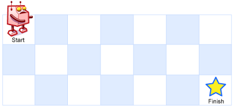
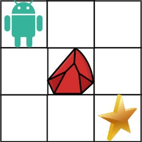
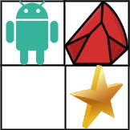

[TOC]

## 动态规划四要素

1. 递推：递归 + 记忆化
2. 状态的转移：opt[n], dp[n], fib[n]
3. 状态转移方程：opt[n] = best_of(opt[n - 1], opt[n - 2], ...)
4. 最优子结构

## 题目

### 62. 不同路径

- 题目描述

```
一个机器人位于一个 m x n 网格的左上角 （起始点在下图中标记为“Start” ）。
机器人每次只能向下或者向右移动一步。机器人试图达到网格的右下角（在下图中标记为“Finish”）。
问总共有多少条不同的路径？
例如，上图是一个 7 x 3 的网格。有多少可能的路径？

示例  1:
输入：m = 3, n = 2
输出：3
解释：
从左上角开始，总共有 3 条路径可以到达右下角。

1. 向右 -> 向右 -> 向下
2. 向右 -> 向下 -> 向右
3. 向下 -> 向右 -> 向右

示例  2:
输入：m = 7, n = 3
输出：28
```



- 方法一：DP

```javascript
var uniquePaths = function (m, n) {
  // a[i][j] = a[i][j - 1] + a[i - 1][j]
  let dp = new Array(m);
  for (let i = 0; i < m; i++) {
    dp[i] = new Array(n);
    for (let j = 0; j < n; j++) {
      if (i === 0 && j === 0) dp[i][j] = 1;
      else if (i === 0) dp[i][j] = dp[i][j - 1];
      else if (j === 0) dp[i][j] = dp[i - 1][j];
      else dp[i][j] = dp[i][j - 1] + dp[i - 1][j];
    }
  }
  return dp[m - 1][n - 1];
};
```

- DP + 滚动数组

```javascript
var uniquePaths = function (m, n) {
  // a[i][j] = a[i][j - 1] + a[i - 1][j]
  let dp = new Array(n);
  dp.fill(0);
  dp[0] = 1;
  for (let i = 0; i < m; i++) {
    for (let j = 0; j < n; j++) {
      if (j >= 1) dp[j] += dp[j - 1];
    }
  }
  return dp[n - 1];
};
```

### 63. 不同路径 II

- 题目描述

```
一个机器人位于一个 m x n 网格的左上角 （起始点在下图中标记为“Start” ）。
机器人每次只能向下或者向右移动一步。机器人试图达到网格的右下角（在下图中标记为“Finish”）。
现在考虑网格中有障碍物。那么从左上角到右下角将会有多少条不同的路径？

示例 1：
输入：obstacleGrid = [[0,0,0],[0,1,0],[0,0,0]]
输出：2
解释：
3x3 网格的正中间有一个障碍物。
从左上角到右下角一共有 2 条不同的路径：
1. 向右 -> 向右 -> 向下 -> 向下
2. 向下 -> 向下 -> 向右 -> 向右

示例 2：
输入：obstacleGrid = [[0,1],[0,0]]
输出：1

m == obstacleGrid.length
n == obstacleGrid[i].length
1 <= m, n <= 100
obstacleGrid[i][j] 为 0 或 1
```





- 方法一：DP

```javascript
var uniquePathsWithObstacles = function (obstacleGrid) {
  let m = obstacleGrid.length;
  let n = obstacleGrid[0].length;
  let dp = new Array(m);
  for (let i = 0; i < m; i++) {
    dp[i] = new Array(n);
    for (let j = 0; j < n; j++) {
      if (obstacleGrid[i][j] === 1) dp[i][j] = 0;
      else if (i === 0 && j === 0) dp[i][j] = 1;
      else if (i === 0) dp[i][j] = dp[i][j - 1];
      else if (j === 0) dp[i][j] = dp[i - 1][j];
      else dp[i][j] = dp[i][j - 1] + dp[i - 1][j];
    }
  }
  return dp[m - 1][n - 1];
};
```

- 方法二 DP + 滚动数组

```javascript
var uniquePathsWithObstacles = function (obstacleGrid) {
  let m = obstacleGrid.length;
  let n = obstacleGrid[0].length;
  let dp = new Array(n);
  dp.fill(0);
  dp[0] = 1;
  for (let i = 0; i < m; i++) {
    for (let j = 0; j < n; j++) {
      if (obstacleGrid[i][j] === 1) dp[j] = 0;
      else if (j >= 1 && obstacleGrid[i][j - 1] === 0) dp[j] += dp[j - 1];
    }
  }
  return dp[n - 1];
};
```
